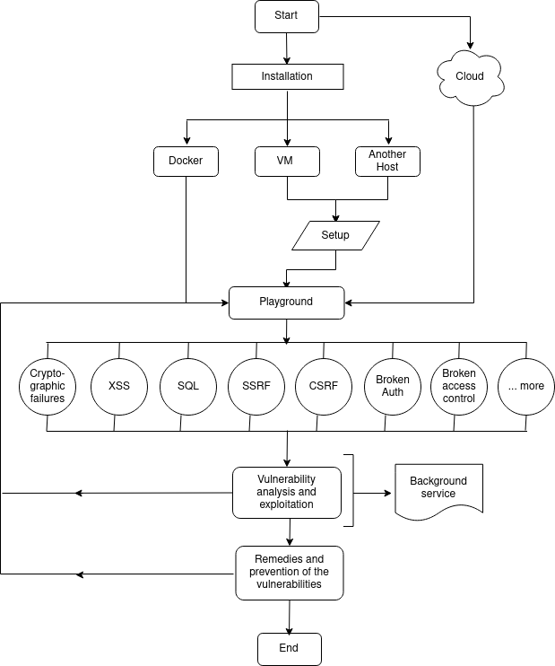
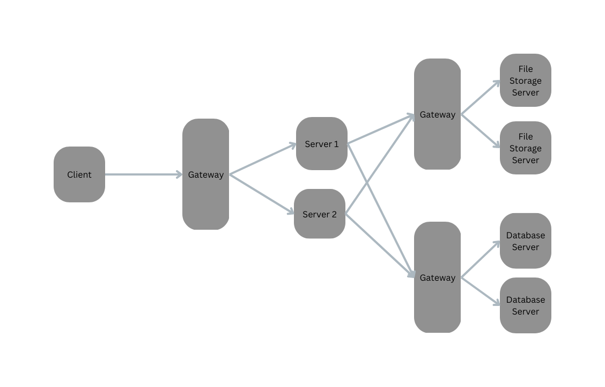

# Proposed System

We propose developing a vulnerable-by-intention web application using modern web technologies that are currently being used in the industry and incorporating some of the most common vulnerabilities found these days according to the OWASP Top Ten project. We propose developing the web application based on a popular category of real world applications to provide exposure to the user of how vulnerabilities arise in actual web applications. In the next section, we give an overview of the developed web application, its technologies and its functionality. After that, we give detailed explanation of the included vulnerabilities along with the techniques of their exploitation.

## Web Application

We have worked on the implementation of an E-commerce web application which includes most of the features provided by a real-world E-commerce website such as Amazon or Flipkart. Next.js, a modern web development framework is used to develop both the frontend and the backend of the web application along with tRPC to build APIs with minimal footprint. NextAuth is used for implementing and incorporating authentication into the web application which helped us easily include normal credential support along with the support for various OAuth providers like Google, Github and Discord. All the data generated by the web application is stored and managed using PostgreSQL which is a powerful relational database management system. The database schema is not tightly coupled which allows for the migration to a microservice architecture in the future, and is fully normalized having most of the constraints at the database level. The application code is written in a modular architecture where each application functionality is completely containerised. Proper error handling and logging are implemented with the assurance that no stack trace is sent to the clients. As an E-commerce web application, many related functionalities have been implemented such as:

- Browsing and Purchasing of Products - Users can search the products, add the products to the shopping cart, review previously completed orders, add their review to the products, post a complaint about the seller of a product and even flag false information about the products.
- Registering of Stores and Selling Products - Users can register and create multiple stores, add new products to their stores or edit already existing ones, receive analytics of their sale and add offers to the products in their stores.
- Marking featured products - The editorial team or personnel can set products that are marked as “Editor’s Choice”, set featured posts and banners for sales.

## Vulnerabilities and Attacks

In this section, we delve into the multiple vulnerabilities that have been intentionally incorporated into the web application.

### Broken Authentication

- The proposed system exhibits a broken authentication vulnerability in both the login and password reset sections of the e-commerce web application. The login page is susceptible to SQL injection attacks due to the improper handling of user input, allowing attackers to submit malicious payloads and potentially bypass the authentication mechanism. The password reset functionality is vulnerable to manipulation of the Host header in incoming requests, which can result in the generation of malicious password reset links.

- The secure versions of these functionalities mitigate the risks by employing parameterized queries for handling user input during the login process and by using server configuration data for generating password reset links, ensuring proper security measures are in place and protecting user accounts from unauthorized access.

### Cross-Site Scripting (XSS)

- Our web application contains an XSS vulnerability in the product descriptions section, specifically related to the handling of Markdown format links. This flaw allows attackers to craft malicious JavaScript links within product descriptions, which can execute harmful code in users' browsers when they visit the product pages. The execution of this malicious code may lead to data theft, session hijacking, or other detrimental activities.

- The secure version of the product description functionality addresses this issue by implementing proper parsing and sanitizing procedures for links within the descriptions. This approach only permits HTTP and HTTPS links, effectively stripping out malicious JavaScript links before rendering them in users' browsers, thereby eliminating the risk of XSS attacks.

### Server-Side Request Forgery (SSRF) and Command Injection

- The web application in our project contains SSRF and command injection vulnerabilities associated with the handling of the Referer header for traffic analysis purposes. The application uses the Referer header to log the text of anchor tags linking to our site and employs the echo system command, which is vulnerable to both SSRF and command injection attacks.

- Attackers can exploit the SSRF vulnerability to target internal systems that are typically inaccessible from external networks. The command injection vulnerability allows attackers to inject arbitrary commands, leading to unauthorized access or manipulation of the server and any connected backend utilities.

- The secure version of the traffic analysis functionality mitigates these risks by utilizing the Node.js Filesystem API instead of the echo system command. This approach ensures proper handling of user inputs and avoids the direct execution of system commands, effectively preventing SSRF and command injection attacks.

### SQL Injection (SQLi)

- The proposed system includes an SQLi vulnerability in the search functionality of the e-commerce web application. This flaw occurs due to the improper handling of user input in the search query, where the application directly incorporates user-supplied search terms into the SQL query instead of using parameterized queries.

- Exploiting this vulnerability, attackers can manipulate the SQL query by submitting malicious payloads as search terms, potentially gaining unauthorized access to sensitive information stored in the database or performing other malicious actions.

- The secure version of the search functionality addresses this vulnerability by using parameterized queries for handling user inputs during the search process. This ensures that user-supplied search terms are treated as data rather than SQL code, effectively preventing attackers from manipulating the SQL query and protecting the database from SQLi attacks.

### Broken Access Control

- The proposed system includes a broken access control vulnerability related to the "Editor's Choice" functionality, which allows the company's editorial team to mark products with this label. The security of this feature relies on the obscurity of the API endpoint, assuming only the editorial team knows its location. However, attackers could potentially discover the hidden endpoint using an API buster tool and gain unauthorized access to mark products with the editorial label.
- The secure version of the "Editor's Choice" functionality mitigates this risk by employing a Role-Based Access Control (RBAC) mechanism to protect the API endpoint. By implementing RBAC, the application ensures that only users with the "editor" role have access to the "Editor's Choice" functionality. This security measure prevents unauthorized users from exploiting the feature and marking products with the editorial label, effectively addressing the broken access control vulnerability.
