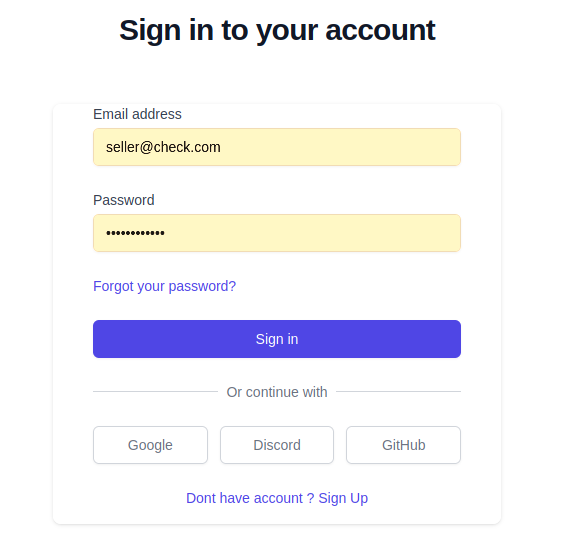
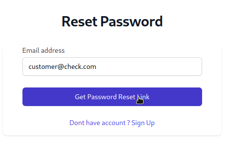
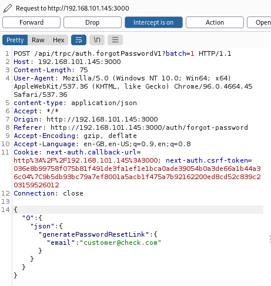
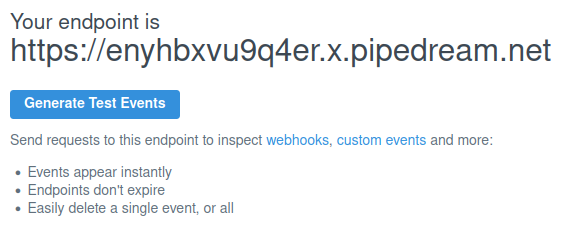
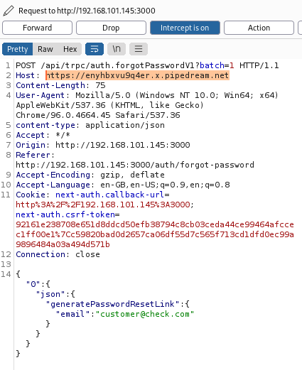
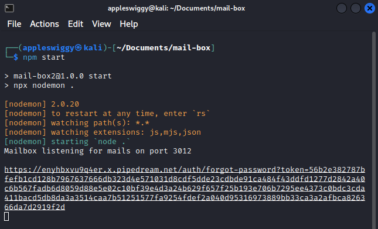
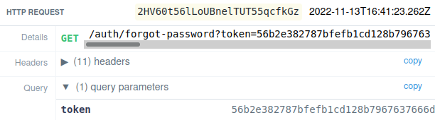
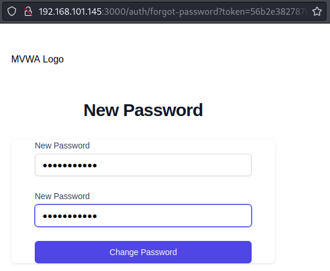
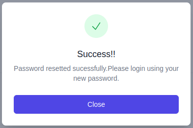

# Broken Authentication

 Authentication can be said to be broken if an attacker can exploit a weakness to impersonate legitimate users on the web application. A typical authentication mechanism involves a login page (as can be seen in below figure) where the user enters his email address and his password.



The server then validates if the user with that email address exists in the database. If a user record is found, the server matches the hash of the password supplied by the user with the one stored on the database corresponding to the user. If the two hashes match, a session ID is randomly generated for the specific user and sent in the response to be set in the user's cookies. In the subsequent requests, the user includes his session ID cookie which enables the server to identify the user. The generated session IDs are random enough to not easily  be guessed by the attackers.
In case the user forgets his password, the application provides the functionality to reset the password. The user is asked to enter his email address and the server sends a link in the user's mailbox containing a unique token in the link’s query parameter.



When the user visits that link, a GET request is sent to the server which receives the token and concludes that it must be sent by the legitimate user and hence, allows the user to set a new password for their account. The reset token is also random enough to not easily be guessed by attackers. However, the application generates the URL that is to be sent to the user by retrieving the domain name of the web application from the “Host” header of the request sent by the user.

This is a mistake on the developer’s end since he believes that the request’s “Host” header can only contain the information about where to send the request. Therefore, the server that receives the request will be sure that the request’s host header contains the website’s domain name.

```JavaScript
const host = ctx.req.headers.host ?? "";
sendMail(host.concat("?token=").concat(token));
```

The code above shows how the server generates the URL to be sent by joining domain name, query parameter name and token together. This is a vulnerability which can be exploited by an attacker to trick the user and steal their token which can then be used by the attacker to reset the user’s password.
An attacker can intercept the request being sent to the server on entering the email address of the victim user and clicking the “Get Password Reset Link” button using an intercepting proxy like Burp.



The attacker can then change the domain in the “Host” header to his evil URL which logs all the requests sent to it. For this task, the attacker can use a web utility like requestbin which creates a specific URL to be used by the attacker and provides a dashboard to view all the requests and their data being sent to that generated URL.



The attacker can now forward the request containing his requestbin generated URL in the “Host” header to the server.



The server generates the password reset URL by extracting this header from the request and sends it to the user’s mailbox. In this case, the server generates the following URL: “<https://enyhbxvu9q4er.x.pipedream.net/auth/forgot-password?token=56b2e382787bfefb1cd128b7967637666db323d4e571031d8cdf5dde23cdbde91ca484f43ddfd1277d2842a40c6b567fadb6d8059d88e5e02c10bf39e4d3a24b629f657f25b193e706b7295ee4373c0bdc3cda411bacd5db8da3a3514caa7b51251577fa9254fdef2a040d95316973889bb33ca3a2afbca826366da7d2919f2d>"


When the user receives this link in his mailbox and clicks it, a GET request is triggered and the attacker receives the password reset token from the query parameter of the link.



The attacker can then visit the vulnerable web application and use this token to change the victim user’s password.





To prevent this vulnerability, the developer should understand that the “Host” header in the received request can be manipulated by the attacker and hence should not be used to fetch the web application’s domain name. Instead a separate configuration file can be created which stores hardcoded domain name and other global parameters. The application who needs the domain name for a functionality can fetch it from this configuration file on the server. Even if the web application migrates to some other domain, only one file will need to be edited for the application to behave correctly.
