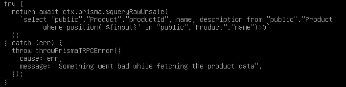
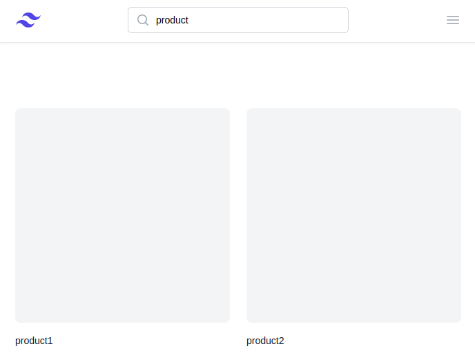
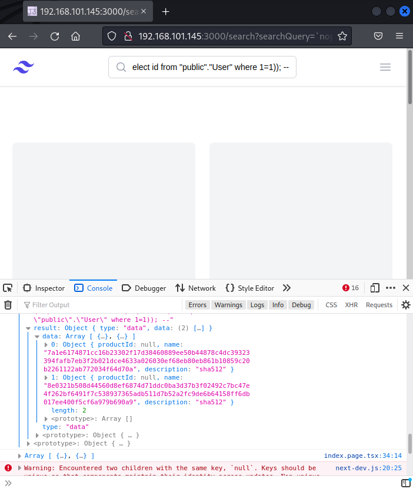
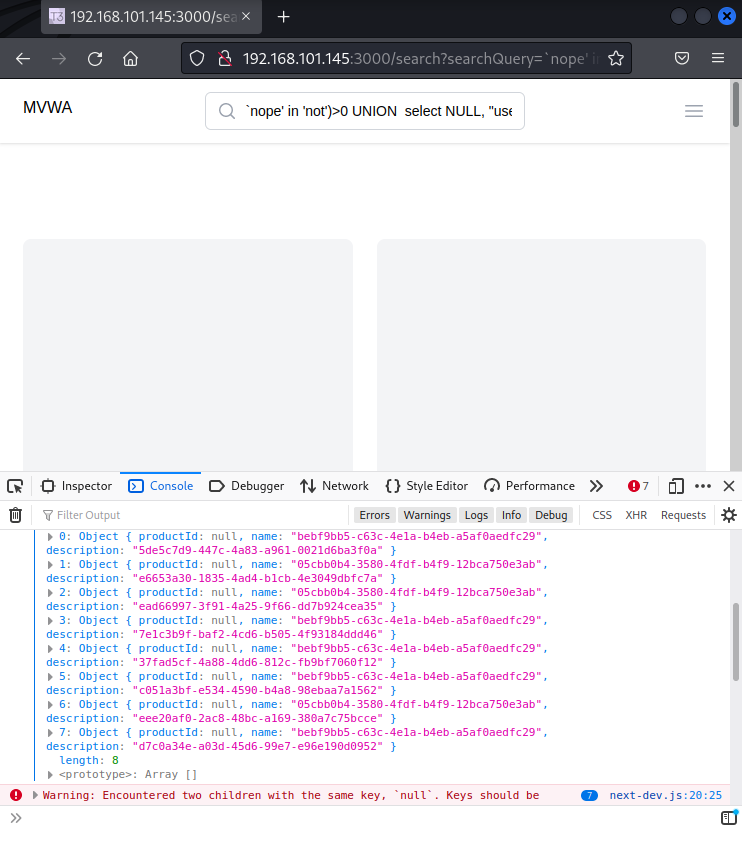
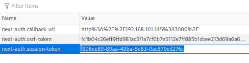
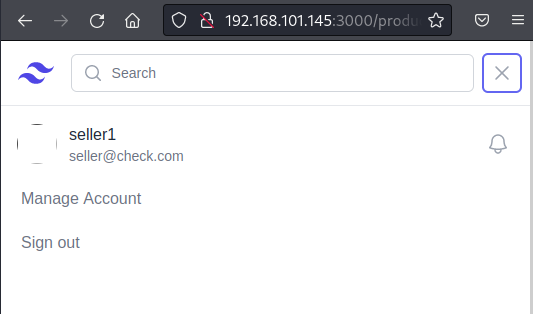

# SQL Injection

In a SQL injection attack, a SQL query is "injected" into the programme through the client's input data. By taking advantage of the SQL injection vulnerability in the vulnerable web application, an attacker may be able to read sensitive data from the database, alter database data (Insert/Update/Delete), carry out database administration tasks (like shutting down the DBMS), and in some cases, issue commands to the operating system.
Numerous high-profile data breaches in recent years have been caused by SQL injection attacks, which have led to reputational damage and legal repercussions. In certain situations, an attacker may be able to access a persistent backdoor, which might lead to a long-lasting breach that could go unnoticed for a very long time.
This project implements a “Search Product” functionality where the user can type in the product’s name in the search bar at the top of the home page to search for the products he wants to view. The user input to the search bar is sent to the server which appends it to a SQL query to be executed by the database server. After the database returns the results of the SQL query to the application server, the server generates an HTTP response containing the results in a prettier format for the client to view.





Since, the application utilizes the user input in the SQL query, an attacker can carefully construct a payload to manipulate the SQL query into retrieving additional data from the database. The attacker can do so with the help of “UNION” query syntax supported by SQL. The attacker can combine the results of two separate queries using the “UNION” keyword as long as the number of columns returned by both the queries are the same and their data types are compatible with each other. There are many ways to find out the number of columns and data types of columns of the original query, such as ordering the result using “ORDER BY” keyword and incrementing the no. of columns up until a noticeable error is emitted or the application starts behaving unusually. The data types can be figured by enumerating all types starting with NULL type which is compatible with all the other types in SQL.
The attacker can use the following payload in the search bar to retrieve users’ password hashes stored on the database along with the hashing algorithm they were hashed with:

```SQL
`nope' in 'not')>0 UNION  select NULL, "public"."Password"."password", "public"."Password"."hashingAlgorithm" from "public"."Password" where "public"."Password"."passwordId" in (select "public"."UserAuthentication"."currentPasswordId" from "public"."UserAuthentication" where "public"."UserAuthentication"."userId" in (select id from "public"."User" where 1=1)); -- 
```



In the screenshot above, we can see that the payload successfully exploited the SQL injection vulnerability to retrieve password hashes. We received an array of two hashes along with the hashing algorithm which is SHA-512. This vulnerability can further be exploited by an attacker to extract session IDs of users that are currently logged into the web application. These session IDs can then be used by the attacker to impersonate other users on the web application. The attacker can use the following payload to perform this task:

```SQL
`nope' in 'not')>0 UNION  select NULL, "userId"::varchar AS eq, "sessionToken"::varchar AS eq from "public"."Session"; -- -
```







To prevent SQL Injection attack, developers should not execute a SQL query on the database containing untrusted user input. If this functionality is required, the input should be thoroughly filtered so that only safe input is allowed. Additionally parameterised queries can be used which are supported by almost all of the popular databases. The parameterised query is sent to the server before appending user input to it. The database parses it and constructs a specific structure to execute the query and stops at this state until input data is sent in. The untrusted user input is sent after, and the database appends it to the already formed structure. This way untrusted user input can’t modify the structure of a SQL query and hence, the attack will not be successful.
